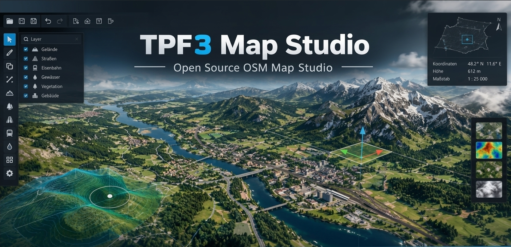
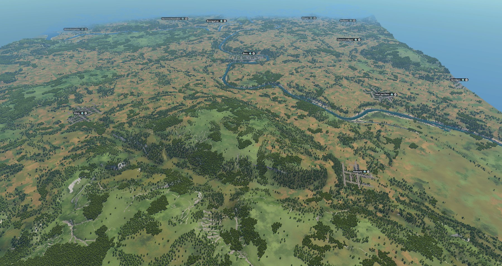

<p align="center">
  
</p>
<p align="center"><sub>Titelbild: Illustration, nicht die echte Programmoberfläche.</sub></p>

# TPF3 Map Studio

**Deutsch** | [English](README.en.md)

Ein freies Werkzeug für Windows, das echte Kartendaten für den Bau realer Karten in **Transport Fever 3** vorbereitet: Kartenausschnitt wählen, OpenStreetMap-Daten und Höhendaten laden und daraus Heightmap, Biome-Maske, Städte, Industrien und eine Bahnhofsliste für den Import im Editor des Spiels erzeugen.

> Inoffizielles Werkzeug. Es steht in keiner Verbindung zu Urban Games oder dem Herausgeber von Transport Fever.
>
> **Sprache:** Das Programm gibt es auf Deutsch und Englisch. Beim ersten Start richtet es sich nach der Windows-Sprache, im Menü **Sprache / Language** lässt sie sich ändern (wirkt nach einem Neustart).

## Download und Start

**[Download für Windows: neueste Version](https://github.com/sharpi13822/TPF3-Map-Studio/releases/latest)**

Keine Python-Installation nötig. So startest du das Programm:

1. Auf der [Release-Seite](https://github.com/sharpi13822/TPF3-Map-Studio/releases/latest) unter **Assets** die Datei `TPF3-Map-Studio-v…-win64.zip` herunterladen
2. Die ZIP-Datei **komplett entpacken**, zum Beispiel auf den Desktop. Nicht aus der ZIP-Datei heraus starten und nicht nur die `.exe` herauskopieren, das Programm braucht den Ordner `_internal` daneben
3. Im entpackten Ordner **`TPF3-Map-Studio.exe`** doppelklicken. Sie liegt gleich oben, neben `START-HIER.txt`, `LICENSE` und dem Ordner `_internal`

Danach geht es weiter mit [So arbeitest du](#so-arbeitest-du).

### Windows warnt beim ersten Start, das ist normal

Da diese `.exe` nicht kostenpflichtig digital signiert ist, zeigt Windows beim allerersten Start meist eine blaue Warnung **„Windows hat Ihren PC geschützt“**. So kommst du daran vorbei:

1. Auf **„Weitere Informationen“** klicken
2. Danach erscheint ein Button **„Trotzdem ausführen“**, darauf klicken

Das erscheint nur beim ersten Start. Falls dein Virenscanner die Datei zusätzlich meldet oder in Quarantäne verschiebt: Das ist ein bekannter **Fehlalarm**, der bei so gebauten (PyInstaller-)Programmen öfter vorkommt, keine tatsächliche Bedrohung. Die Datei ggf. aus der Quarantäne wiederherstellen bzw. eine Ausnahme dafür einrichten.

### Systemvoraussetzungen

- Windows 10 oder 11 (64-Bit)
- Internetverbindung (für den OSM- und Höhendaten-Download)
- Ca. 520 MB freier Speicherplatz für das entpackte Programm
- Für große Karten mit dem DGM1 mehrere GB freier Arbeitsspeicher, die Höhendaten werden dabei im Speicher verarbeitet

## Inhalt

- [Download und Start](#download-und-start)
- [Beispiel: Bern im Spiel](#beispiel-bern-im-spiel)
- [Funktionen](#funktionen)
- [So arbeitest du](#so-arbeitest-du)
- [Selbst bauen: von Python bis zur .exe](#selbst-bauen-von-python-bis-zur-exe)
- [Daten und Quellenangaben](#daten-und-quellenangaben)
- [Danksagung](#danksagung)
- [Fragen, Probleme und Kontakt](#fragen-probleme-und-kontakt)
- [Unterstützung](#unterstützung)
- [Lizenz](#lizenz)

## Beispiel: Bern im Spiel

<p align="center">
  
</p>
<p align="center"><sub>Ansicht in Transport Fever 3: Gelände aus swissALTI3D, Gewässer, Orte und Biome aus OpenStreetMap, erzeugt mit dem Studio. Quellen: © swisstopo (Bundesamt für Landestopografie swisstopo), © OpenStreetMap-Mitwirkende.</sub></p>

## Funktionen

- **Kartenausschnitt** per Rechteck-Tool festlegen (Mittelpunkt, Größe, Drehwinkel) und im Format des Spiels (z. B. Größenwahnsinnig 1:5) planen
- **OSM-Daten laden** mit konfigurierbarer Overpass-Abfrage (Checkboxen und Vorlagen statt Freitext)
- **Heightmap** aus dem DGM1 (Deutschland, 1 m), aus swissALTI3D (Schweiz und Liechtenstein, 2 m), aus Copernicus (weltweit, 30 m, mit Baumkronen) oder aus eigenen GeoTIFF-Kacheln. Mit Schnellvorschau (immer Copernicus), Wasserhöhen-Vorschlag, Flüssen nach OSM, Gefälle-Ausgleich, Einebnen von Trassen und Siedlungen, Glätten und Stauchen sowie einem Höhenfenster für die Grenzen des Karteneditors (−20 bis 3177 m: Gipfel kappen, Tiefen abschneiden oder stauchen, mit Vorschau). Der Dialog nennt die Werte, die beim Import im Spiel einzutragen sind. Die Heightmap wird als 16-Bit-PNG gespeichert
- **Biome-Maske, Städte und Industrien** aus OSM, als Dateien für den Import im Editor
- **Bahnhöfe** als Marker mit Namen auf der Karte und als Liste (`bahnhoefe.json` und `bahnhoefe.csv`) mit Bahnsteigen, Haltepositionen und Status (aufgegeben, im Bau). Im Spiel wird dadurch nichts gebaut, die Liste dient als Nachschlagewerk
- **Karte:** OpenStreetMap, wahlweise mit Schattenrelief, dazu zuschaltbar die Eisenbahnkarte (OpenRailwayMap) und ein Maß-Gitter. Ebenen lassen sich ein- und ausblenden, sperren, in der Deckkraft und in der Reihenfolge ändern
- Eigene Straßen, Flüsse und Gebäude zeichnen, JSON-Export und -Import der Objekte
- Koordinaten-Messwerkzeug, Vorab-Prüfung der geladenen Daten, Projekte speichern und Projekt-Dashboard

### Höhenquellen im Überblick

| Quelle | Gebiet | Auflösung | Woher | Hinweis |
| --- | --- | --- | --- | --- |
| Copernicus DEM (GLO-30) | weltweit | 30 m | Copernicus (AWS Open Data) | enthält Baumkronen, Standard der Schnellvorschau |
| DGM1 Deutschland | Deutschland | 1 m | hoehendaten.de (Landesvermessung) | etwa 20 Kacheln pro Minute, große Karten brauchen eine halbe Stunde |
| swissALTI3D | Schweiz und Liechtenstein | 2 m | data.geo.admin.ch (swisstopo) | nur bei Karten dort wählbar, Quellenangabe ist Pflicht |
| Eigene Kacheln | Deutschland | je nach Datei | selbst bei einem Landesportal geladen | GeoTIFF auf dem 1-km-Raster (UTM) |

Wo Daten einer Quelle fehlen, ergänzt das Studio aus Copernicus. Die Höhenquelle wählst du im Heightmap-Dialog.

Funktionen für den OSM-TPF2-Importer von Vacuum-Tube (OSM-Export als `.osm`, Mod-Checker, Import-Anleitung, Prüfung kurzer Verbindungssegmente) sind in dieser Version ausgeblendet. Der Code bleibt im Projekt und lässt sich über den Schalter `VACUUMTUBE_IMPORTER` in `src/features.py` wieder einblenden.

Eine vollständige Beschreibung aller Funktionen steht im Studio unter **Hilfe → Funktionsübersicht**.

## So arbeitest du

1. Mit dem Marker-Werkzeug die Kartenmitte setzen, dann **Werkzeuge → Rechteck-Tool**: Kartengröße und Drehwinkel wählen
2. **Werkzeuge → OSM laden**. Was geladen wird, stellst du unter **Werkzeuge → Overpass-Abfrage** ein
3. **Werkzeuge → Heightmap herunterladen**: Höhenquelle wählen, Einstellungen prüfen, Höhendaten laden und exportieren. Unten im Dialog stehen Mindesthöhe, Maximalhöhe, Wasserhöhe und Kartenformat für den Import
4. Im selben Dialog optional **Biome-Maske**, **Städte**, **Industrien** und **Bahnhöfe** aus OSM erzeugen
5. Im Editor von Transport Fever 3 die Dateien importieren und die Zahlen aus Schritt 3 eintragen

Die Anleitung im Heightmap-Dialog öffnest du mit F1.

## Selbst bauen: von Python bis zur .exe

Diese Anleitung führt Schritt für Schritt von einem Windows-Rechner ohne Python bis zur fertigen `.exe`. Alle Befehle gibst du in der **PowerShell** ein (Startmenü, „PowerShell“ eintippen, Enter).

Du brauchst: Windows 10 oder 11 (64-Bit), eine Internetverbindung und einige GB freien Speicherplatz (Python, die Pakete und das Bauen brauchen Platz).

### 1. Python installieren

1. Auf <https://www.python.org/downloads/release/python-3119/> nach unten scrollen und den **Windows installer (64-bit)** von **Python 3.11.9** herunterladen. Mit dieser Version ist das Studio getestet. Andere 3.11-Versionen sollten ebenfalls gehen. Python 3.12 und neuer sind mit der festgelegten PySide6-Version 6.7.2 nicht getestet.
2. Den Installer starten und im **ersten Fenster unten den Haken bei „Add python.exe to PATH“ setzen**. Das ist der häufigste Stolperstein. Danach auf **„Install Now“** klicken.
3. Eine **neue** PowerShell öffnen und prüfen:
   ```
   python --version
   ```
   Es erscheint `Python 3.11.9`. Öffnet sich stattdessen der Microsoft Store, schalte unter *Einstellungen → Apps → Erweiterte App-Einstellungen → App-Ausführungsaliase* die Einträge für `python.exe` aus und versuche es erneut.

### 2. Das Studio herunterladen

Ohne Git: Auf der GitHub-Seite des Projekts auf den grünen Knopf **Code** klicken, **Download ZIP** wählen und das ZIP in einen Ordner mit kurzem Pfad ohne Leer- und Sonderzeichen entpacken, zum Beispiel `C:\TPF3-Map-Studio`.

Mit Git (<https://git-scm.com/download/win>), das spätere Aktualisieren mit `git pull` ist dann einfacher:
```
git clone https://github.com/sharpi13822/TPF3-Map-Studio.git
```

### 3. In den Projektordner wechseln

```
cd C:\TPF3-Map-Studio
```
Den Pfad an deinen Ordner anpassen. Im Windows-Explorer geht es auch so: den Ordner öffnen, in die Adresszeile `powershell` tippen und Enter drücken.

### 4. Virtuelle Umgebung anlegen und einschalten

Die virtuelle Umgebung hält die Pakete des Studios getrennt vom Rest deines Systems.
```
python -m venv .venv
.venv\Scripts\Activate.ps1
```
Danach steht `(.venv)` am Anfang der Zeile. Meldet die PowerShell, dass Skripte nicht ausgeführt werden dürfen, einmalig dies eingeben, mit **J** bestätigen und den zweiten Befehl wiederholen:
```
Set-ExecutionPolicy -Scope CurrentUser RemoteSigned
```

### 5. Pakete installieren

```
python -m pip install --upgrade pip
pip install -r requirements.txt
```
Das lädt unter anderem PySide6 (mit Qt WebEngine) und dauert einige Minuten.

### 6. Das Studio starten (Test)

```
python -m src.main
```
Es öffnet sich das Fenster mit der Karte. Läuft das, ist alles richtig installiert.

### 7. Die .exe bauen

```
pip install pyinstaller
pyinstaller build.spec
```
Fragt PyInstaller am Ende **„The output directory … will be REMOVED! Continue? (y/N)“**, antworte mit `y`. Das passiert, wenn es schon einen alten Bauordner gibt. Das Bauen dauert einige Minuten.

Das Ergebnis liegt in:
```
dist\TPF3-Map-Studio\TPF3-Map-Studio.exe
```
Zum Weitergeben packst du den **ganzen Ordner** `dist\TPF3-Map-Studio` in eine ZIP-Datei. Die `.exe` allein läuft nicht, sie braucht den Ordner `_internal` daneben.

### 8. Alles in einem Schritt (optional)

Das Skript `tools\make_release.ps1` baut die `.exe`, prüft, dass die Symbole im Paket liegen, legt `START-HIER.txt`, `LICENSE` und `THIRD_PARTY_NOTICES.md` neben die `.exe` und packt den ganzen Ordner in eine ZIP-Datei samt Prüfsumme. Mit vorhandener `.venv` im Projektordner:
```
powershell -ExecutionPolicy Bypass -File tools\make_release.ps1 -Version 0.1.1
```
Die ZIP heißt dann `TPF3-Map-Studio-v0.1.1-win64.zip`. Sie gehört nicht ins Git-Repository, sondern als Datei an ein Release auf GitHub (siehe unten).

### 9. Prüfen

- `TPF3-Map-Studio.exe` doppelklicken. Beim ersten Start warnt Windows (siehe oben).
- Ob die Symbole mitgekommen sind, zeigt dieser Befehl. Er sollte zwei Treffer ausgeben:
  ```
  Get-ChildItem dist\TPF3-Map-Studio -Recurse -Filter "strassen_hell.png" | Select-Object FullName
  ```

### 10. Als Release auf GitHub veröffentlichen (für Projektbetreuer)

1. Auf GitHub **Releases → Draft a new release**
2. Einen neuen Tag anlegen, zum Beispiel `v0.1.1` (auf `master`)
3. Die ZIP-Datei bei **Assets** anhängen, die Prüfsumme aus `…sha256.txt` in die Beschreibung schreiben und veröffentlichen

Der Link „Download für Windows" oben im README führt danach automatisch zur neuesten Version.

### Wenn etwas nicht klappt

| Problem | Lösung |
| --- | --- |
| `python` wird nicht erkannt | Python neu installieren und den Haken „Add python.exe to PATH“ setzen. Danach eine **neue** PowerShell öffnen |
| „Ausführung von Skripts ist deaktiviert“ | `Set-ExecutionPolicy -Scope CurrentUser RemoteSigned` eingeben, siehe Schritt 4 |
| `pip install` meldet „No matching distribution found for PySide6“ | Mit `python --version` die Version prüfen. Python 3.11.9 (64-Bit) verwenden |
| Die `.exe` startet, aber das Fenster bleibt leer oder schließt sich | In `build.spec` die Zeile `console=False` auf `console=True` setzen und neu bauen. Dann zeigt ein schwarzes Fenster die Fehlermeldung. Bitte mit einem [Issue](https://github.com/sharpi13822/TPF3-Map-Studio/issues) melden |
| Virenscanner schlägt an | Bekannter Fehlalarm bei PyInstaller-Programmen, siehe oben |
| Nach einem Update fehlen Pakete | Mit aktivierter `.venv` erneut `pip install -r requirements.txt` ausführen |

Die Tests liegen im Ordner `tests`, zum Beispiel `python -m unittest tests.test_readme`.

## Daten und Quellenangaben

Das Studio nutzt öffentliche Datenquellen. Wer eine damit erzeugte Karte veröffentlicht, sollte die Quellen nennen:

- **Kartendaten:** © OpenStreetMap-Mitwirkende, Open Database License (ODbL)
- **Höhendaten Deutschland (DGM1):** je nach Bundesland Datenlizenz Deutschland, Namensnennung, Version 2.0 (dl-de/by-2-0). Die genaue Quellenangabe zeigt der Heightmap-Dialog an
- **Höhendaten Schweiz und Liechtenstein (swissALTI3D):** © swisstopo (Bundesamt für Landestopografie swisstopo), Open Government Data, Quellenangabe ist Pflicht
- **Höhendaten weltweit:** Copernicus DEM (GLO-30)

Alle Quellen, Lizenzen und Hinweise stehen in [THIRD_PARTY_NOTICES.md](THIRD_PARTY_NOTICES.md).

## Danksagung

- [OpenStreetMap](https://www.openstreetmap.org/copyright)-Mitwirkende für die Kartendaten
- [Leaflet](https://leafletjs.com/) für die Kartendarstellung
- [Copernicus](https://copernicus-dem-30m.s3.amazonaws.com/) für die weltweiten Höhendaten
- Die Landesvermessungsämter für das DGM1 und [hoehendaten.de](https://hoehendaten.de/) für den Zugang dazu
- [swisstopo](https://www.swisstopo.admin.ch/) für swissALTI3D
- [Vacuum-Tube](https://github.com/Vacuum-Tube/OSM-TPF2-Importer) für den OSM-TPF2-Importer. Das Studio ging aus dem Wunsch hervor, Daten für ihn aufzubereiten. Der Importer ist ein eigenständiges Projekt unter eigener Lizenz

## Fragen, Probleme und Kontakt

- **Fehler oder Wünsche:** bitte ein [Issue](https://github.com/sharpi13822/TPF3-Map-Studio/issues) eröffnen
- **Fragen, Ideen und Austausch:** in den [Discussions](https://github.com/sharpi13822/TPF3-Map-Studio/discussions)

Bei einem Fehler helfen diese Angaben: Version des Studios, Windows-Version, was du getan hast, die genaue Fehlermeldung (wenn vorhanden) und ob der Fehler jedes Mal auftritt. Screenshots sind willkommen. Bitte keine Kartendateien mit privaten Daten anhängen.

## Unterstützung

Das Studio ist kostenlos und entsteht in der Freizeit. Wenn es dir hilft und du die Weiterentwicklung unterstützen möchtest, freue ich mich über eine Spende. Sie ist freiwillig und verändert nichts an der Nutzung.

<a href="https://paypal.me/PEttelt"></a>

## Lizenz

MIT, siehe [LICENSE](LICENSE). Hinweise zu den verwendeten Daten, Diensten und Bibliotheken stehen in [THIRD_PARTY_NOTICES.md](THIRD_PARTY_NOTICES.md).
